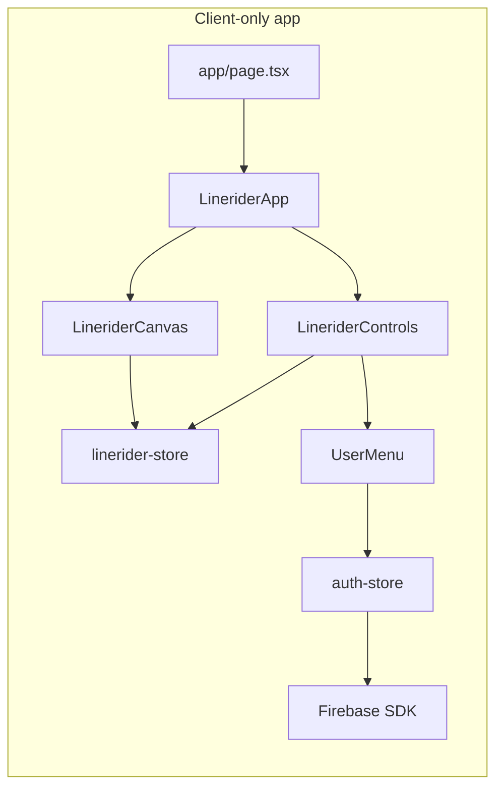

# AGENTS.md — Ride.me

Single source of truth for autonomous agents (Codex, Cursor, Claude Code, etc.) working in this repository.

## Project overview

**Ride.me** is a browser-based **Line Rider** clone: users draw track segments on an infinite canvas, place a rider start, and watch Verlet physics simulation play back the ride. The app ships as a single-page experience at `/` with optional Firebase authentication for profiles.

**Product purpose:** Recreate the classic draw → play → iterate creative loop with a modern web stack, optional accounts, and a path toward cloud save and sharing (rules exist; product code does not yet).

**Deployment:** Vercel (`ride.me`). License: AGPL-3.0.

## Tech stack

| Layer | Choice |
|-------|--------|
| Framework | Next.js 16 App Router |
| UI | React 19, Tailwind CSS 4 |
| Language | TypeScript (strict) |
| State | Zustand (`subscribeWithSelector`) |
| Auth / DB | Firebase Auth + Firestore (client SDK, lazy init) |
| Icons | lucide-react |
| Package manager | **npm** (`package-lock.json` only — never switch) |

There is **no** custom backend, API routes, Server Actions, middleware, job queue, or test runner in this repo today.

## Repository structure

```
src/
├── app/                    # Routes: /, /privacy, /terms, error, not-found
├── components/
│   ├── auth/               # Modals, avatar, character picker, user menu
│   ├── linerider/          # Game shell: app, canvas, toolbar
│   └── ui/                 # loading-spinner
├── hooks/                  # use-auth, use-modal-a11y
├── lib/
│   ├── firebase/           # config, auth, users (profiles only)
│   └── linerider/          # physics, renderer, characters, spatial hash
└── stores/
    ├── auth-store.ts
    └── linerider-store.ts
```

Root config: `next.config.mjs`, `eslint.config.mjs`, `tsconfig.json`, `firestore.rules`, `storage.rules`, `env.example`.

Product roadmap and acceptance criteria: **`spec.md`** (read before feature work).

## Core architecture



- **Rendering:** One full-viewport `<canvas>`. `requestAnimationFrame` loop in `linerider-canvas.tsx` runs physics (fixed `PHYSICS_DT`, accumulator cap) and draws via `renderer.ts` + `characters.ts`.
- **State:** All game state lives in `linerider-store.ts` (segments, camera, rider, tools, settings, spatial hash cache). Auth in `auth-store.ts` with a single `onAuthStateChanged` subscription.
- **Firebase:** `isFirebaseConfigured()` gates UI and SDK calls. Without env vars, the game runs fully; auth UI is hidden.
- **No route protection:** There are no protected routes or middleware. Auth is optional UI on the home page only.

## Features that exist today

Verified in code (not docs):

- **Drawing:** Pencil tool (`draw`), pan (`pan`), eraser (`erase`). Three line types: `normal`, `accel`, `scenery`. Freehand segments with min draw distance; batched erase via `erasePath`.
- **Playback:** Space toggles play/pause. **Pause resumes** from current rider state (does not reset). `resetRider()` exists but is **not** exposed in the toolbar. `R` / Home / `0` call `resetCamera()` (resets camera, rider to start, elapsed time, stops playback).
- **Physics:** Verlet ball rider, spatial hash collisions, out-of-bounds auto-pause, playback speeds `0.25×–4×` (validated in store).
- **Camera:** Wheel zoom at cursor, follow toggle (`F`), grid toggle (`G`).
- **History:** Undo only (`⌘Z` / `Ctrl+Z`), max 200 steps. **No redo.**
- **Characters:** ball, snowboarder, skateboarder, horse — canvas-rendered; profile sync when signed in.
- **Auth:** Google popup, email/password, email link (with `EmailConfirmModal` when email missing from storage). Profiles at `/users/{uid}`.
- **Legal pages:** `/privacy`, `/terms` (static). 404 has home link.
- **Not implemented:** Track save/load/share, straight-line tool, flags/timeline, redo, select/move, API routes, tests, PWA/offline.

## Important commands

```bash
npm install          # Install dependencies (use lockfile)
npm run dev          # Dev server → http://localhost:3000
npm run lint         # ESLint (flat config, eslint-config-next)
npm run type-check   # tsc --noEmit
npm run build        # Production build (also catches many TS issues)
npm start            # Run production build locally
```

### Canonical validation (run before committing)

```bash
npm run lint && npm run type-check && npm run build
```

**No `npm test`** — Jest/Vitest/Playwright are not configured. Do not add a test command unless the task explicitly introduces testing infrastructure.

### Non-interactive rules

- Never use watch mode (`--watch`, Jest watch, etc.).
- Never open a headed browser or require manual login for validation.
- Never run `npm run dev` and wait for interactive prompts.
- Firebase-dependent flows: validate with lint/type-check/build only unless env is documented in the task.

## Development conventions

- **Files:** `kebab-case.ts` / `kebab-case.tsx`
- **Hooks:** `use-*.ts`
- **Types:** `PascalCase` with suffixes (`State`, `Actions`, `Props`); prefer `type` over `interface` where the codebase does
- **Client boundary:** Add `"use client"` to every component/hook that uses browser APIs, Zustand, or Firebase
- **Imports:** `@/*` path alias → `src/*`
- **Barrels:** `index.ts` in `components/auth`, `lib/firebase`, `lib/linerider`
- **State updates:** Immutable patterns in Zustand; use `useShallow` for multi-field selectors in components
- **Comments:** Only for non-obvious logic; prefer self-explanatory code
- **Generated files:** Do not edit `.next/` or hand-edit `next-env.d.ts`; do not change `package-lock.json` except via `npm install` for intentional dep changes

## TypeScript and lint

- `strict: true` in `tsconfig.json`
- ESLint: `eslint.config.mjs` extends `eslint-config-next/core-web-vitals`
- Fix all lint and type errors in touched files before committing
- TypeScript 6 / Next 16: follow existing patterns when types break on upgrade

## Server / client guidance

- The app is effectively **client-rendered**. `app/page.tsx` only imports `LineriderApp` (client).
- Do not add Server Actions or API routes unless `spec.md` calls for them and Firebase/security implications are addressed.
- Firebase must stay client-side with `NEXT_PUBLIC_*` env vars (see `env.example`).
- Static legal routes (`privacy`, `terms`) may remain Server Components without `"use client"`.

## Route protection

**None today.** Do not assume middleware or server-side session checks. If adding protected routes later, coordinate with Firestore rules and Firebase Auth session handling in `auth-store`.

## State management guidance

- **Game:** Only `linerider-store.ts` — tools, segments, camera, rider, playback, spatial hash
- **Auth:** Only `auth-store.ts` — call `init()` from `use-auth` once; never duplicate `onAuthStateChanged`
- Avoid prop drilling for store-backed data; components subscribe directly
- Physics stepping belongs in the canvas loop calling `stepSimulation(dt)` — do not duplicate physics in components
- Track mutations must go through `commitTrackChange` / `pushHistory` patterns so `trackVersion` and undo stay consistent

## Testing expectations

- No automated tests. Manual smoke test: draw segments, play/pause, undo, sign-in (if Firebase configured).
- Do not block doc-only commits on absent tests.

## Files and systems requiring extra caution

| Area | Why |
|------|-----|
| `src/lib/linerider/physics.ts` | Core simulation; small changes affect feel and stability |
| `src/components/linerider/linerider-canvas.tsx` | RAF loop, pointer handling, DPR sizing |
| `firestore.rules` / `storage.rules` | Security; validate operator precedence and owner checks |
| `src/stores/auth-store.ts` | Single auth subscription; race-sensitive `hasInitialized` |
| `package.json` / lockfile | Repo uses npm overrides for ESLint 10 + Next compat |
| `env.example` | Never commit real secrets |

## Git workflow

| Branch | Role |
|--------|------|
| `main` | Stable production. **Never push or commit directly.** |
| `dev` | Autonomous working branch. **All agent commits go here.** |

Workflow for every task:

1. `git fetch origin`
2. `git checkout dev`
3. `git pull origin dev` (if branch exists on remote)
4. If `dev` is behind `main`, merge or rebase from `origin/main` into `dev` before large work (document in commit if needed)
5. Make **one focused, PR-sized change** per agent run (single feature or doc slice)
6. Run canonical validation
7. Commit to `dev` with a clear message
8. `git push origin dev` only — **never** `git push origin main`

Do **not** create feature branches. Do **not** open pull requests unless the user explicitly asks.

## Definition of done

- [ ] On branch `dev` (not `main`)
- [ ] Change matches the assigned task scope (one logical unit)
- [ ] `npm run lint && npm run type-check && npm run build` pass
- [ ] No secrets committed; env documented in `env.example` if new vars added
- [ ] `spec.md` updated if product behavior or roadmap changed
- [ ] Pushed to `origin/dev` when the task requires delivery

## Rules for autonomous Codex runs

1. Read **AGENTS.md** and **spec.md** before coding.
2. Prefer the smallest correct diff; reuse existing modules.
3. One PR-sized outcome per run — even when committing directly to `dev`.
4. Infer behavior from code when docs disagree; update docs if you fix drift.
5. Do not implement roadmap items outside the current task.
6. Do not refactor unrelated dead code unless the task requires it.
7. Do not switch package managers or add frameworks without explicit approval.

## Stop conditions

Stop and report (do not guess) when:

- Uncommitted changes exist that are unrelated to your task and not safely composable
- `git pull` / merge conflicts need human judgment
- Firebase or Vercel secrets are required but missing
- Validation fails after two focused fix attempts — report errors verbatim
- The task would require pushing to `main` or merging `dev` → `main`
- Scope expands to multiple roadmap milestones — ask to split work

## Quick reference: keyboard shortcuts (implemented)

| Key | Action |
|-----|--------|
| D | Draw tool |
| H / P | Pan tool |
| E | Erase tool |
| 1 / 2 / 3 | Line type + draw tool |
| Space | Play / pause |
| + / - | Zoom in / out |
| G | Toggle grid |
| F | Toggle camera follow |
| R / Home / 0 | Reset camera + rider to start |
| ⌘Z / Ctrl+Z | Undo |
| C | Clear track |
| Shift+click | Set rider start |

See `spec.md` for planned shortcuts (redo, line tool, flags, save/load, etc.).
